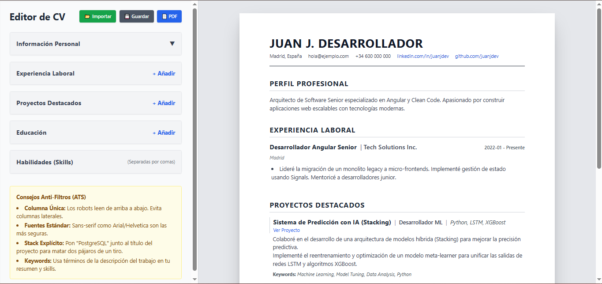

# ATS-Ready CV Builder

> **Crea CVs profesionales y optimizados para ATS en tiempo real.**

Este proyecto es una aplicación web moderna y de código abierto diseñada para ayudar a los usuarios a crear Curriculums Vitae (CV) limpios, estructurados y optimizados para Sistemas de Seguimiento de Candidatos (ATS). Construido con las últimas tecnologías web, enfatiza el rendimiento, la simplicidad y la privacidad del usuario.




## 🚀 Características Principales

*   **Diseño Optimizado para ATS**: Diseño de una sola columna, centrado en texto, asegurando máxima compatibilidad con los analizadores ATS.
*   **Vista Previa en Tiempo Real**: Interfaz de pantalla dividida que muestra actualizaciones instantáneas mientras escribes.
*   **Privacidad Primero**: Todos los datos se almacenan localmente en tu navegador (`LocalStorage`). No se envía ningún dato a ningún servidor.
*   **Exportación a PDF**: Exportación nativa del navegador a PDF con un solo clic.
*   **Exportación/Importación JSON**: Guarda tus datos en un archivo JSON para editarlos más tarde o moverlos entre dispositivos.
*   **Stack Tecnológico Moderno**: Construido con Angular 18+ (Componentes Standalone, Signals) y TailwindCSS.
*   **Responsivo**: Funciona perfectamente en dispositivos de escritorio y tabletas.

## 🛠️ Stack Tecnológico

Este proyecto aprovecha lo último del ecosistema Angular:

*   **Framework**: [Angular](https://angular.io/) (Última Versión)
    *   **Componentes Standalone**: Sin NgModules, reduciendo el código repetitivo.
    *   **Signals**: Gestión de estado granular y reactiva para alto rendimiento.
    *   **Reactive Forms**: Formularios estrictamente tipados para un manejo robusto de datos.
*   **Estilos**: [TailwindCSS](https://tailwindcss.com/) - CSS basado en utilidades para un desarrollo de UI rápido y consistente.
*   **Herramientas**:
    *   **Bun**: Runtime de JavaScript y gestor de paquetes todo en uno de alta velocidad.
    *   **Vite/Esbuild**: El nuevo sistema de construcción de alto rendimiento de Angular.
*   **Despliegue**: Ejecuta el comando `ng deploy:gh` para desplegar la aplicación en GitHub Pages.

## 🏗️ Arquitectura

La aplicación está estructurada para escalabilidad y mantenibilidad:

*   **Gestión de Estado**: Un `ResumeService` centralizado utiliza Angular Signals para gestionar el estado de los datos del CV, proporcionando una única fuente de verdad que alimenta tanto al componente Editor como al de Vista Previa.
*   **Diseño de Componentes**:
    *   `EditorComponent`: Maneja la entrada del usuario a través de Reactive Forms.
    *   `PreviewComponent`: Componente de presentación pura que reacciona a los cambios de estado.
*   **Persistencia**: Los datos se guardan automáticamente en `LocalStorage` con cada cambio, asegurando que nunca pierdas tu trabajo al recargar.

## 📦 Empezando

### Requisitos Previos

*   **Node.js** (v18+) o **Bun** (v1+)
*   **Git**

### Instalación

1.  **Clonar el repositorio**:
    ```bash
    git clone https://github.com/stally-ortega/cv-maker.git
    cd cv-maker
    ```

2.  **Instalar dependencias**:
    ```bash
    npm install
    # O si usas Bun
    bun install
    ```

3.  **Ejecutar el servidor de desarrollo**:
    ```bash
    ng serve
    ```
    Navega a `http://localhost:4200/` o prueba online en [GitHub Pages](https://stally-ortega.github.io/CVMaker/).

## 🤝 Contribuciones

¡Las contribuciones son bienvenidas! Este es un proyecto de código abierto y nos encanta la participación de la comunidad.

1.  **Haz un Fork** del repositorio.
2.  Crea una nueva **Rama** para tu funcionalidad o corrección (`git checkout -b feature/FuncionalidadAsombrosa`).
3.  **Haz Commit** de tus cambios (`git commit -m 'Agrega alguna FuncionalidadAsombrosa'`).
4.  **Haz Push** a la rama (`git push origin feature/FuncionalidadAsombrosa`).
5.  Abre un **Pull Request**.

Por favor, asegúrate de que tu código siga las guías de estilo existentes e incluya comentarios relevantes.

## 📄 Licencia

Este proyecto está licenciado bajo la **Licencia MIT** - mira el archivo [LICENSE](LICENSE) para más detalles.

---
*Creado con ❤️ por [Stally Ortega]*
